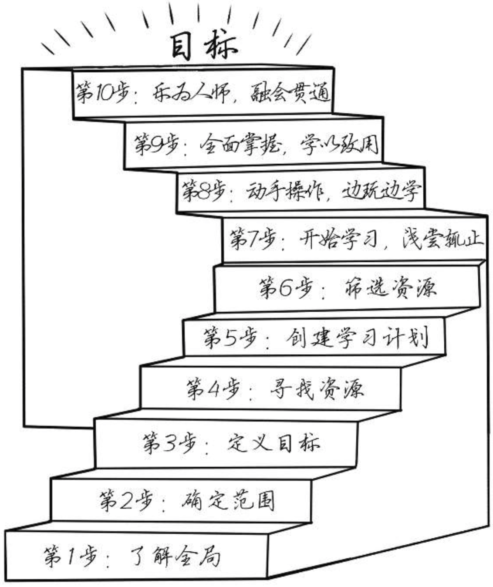

### 1.为什么会读这本书?
毕业5年,也作为程序员工作了5年,刚工作的头三年可能看与工作相关的专业书比较多.转眼人到中年,结婚生子,生活的担子加重了,同时近几年经济形势不景气,偶尔会为之后的生活担忧. 偶然在微信读书上看到了这本书,点开读了开头几章,其中有一个观点就是“经营自己的职业生涯就像经营一家企业”,深以为然,作为程序员它的生存之本就是自己的构建软件的能力,如果把它当作自己的一个产品,公司雇佣你相当于想你购买你的产品,如果你的产品达不到要求,可能后续公司就不会继续购买了,反之,如果你的产品足够优秀,就会供不应求,价格也水涨船高. 回想之前的工作心态可能是尽力做好领导分配的任务,希望能到同事和领导的认可,出于这样的一种目的去工作.而不是自我成长,自我驱动的形式去工作.努力让自己变得更好,自己的价值变高了,也能够帮助其他人.

### 2.这本书的主题是啥?
顾名思义,作者想从写代码之外的角度去谈论程序员还应该培养哪些能力,比如说: 商业能力,如果把软件开发当作一份产品,如果去增加产品力的同时做好营销,更好的产品卖出去; 

### 3.这本书给我的启发有哪些?

#### 十步学习法:

- **了解全局:** 先了解要学习的东西的框架,不要开始就埋头于细节中,陷入"不是庐山真面目,只缘身在此山中"的窘境

- **确定范围:** 对于要学习的东西不需要全部掌握,这里可以利用八二原则,把你感兴趣,实用性更好的点优先掌握,这里可以省去大部分的时间

- **定义目标:** 对于上一步确定的范围,要明确最后验收的标准,要细化到最后学习完可以检验是否真的完成了

- **寻找资源:** 用尽各种办法寻找学习资料,包括与人交流,像别人请教,查阅电子资料,书籍,视频等

- **创建学习计划:** 根据所确定的目标进行拆解细化到具体每周甚至每天的学习任务,定期check

- **筛选资源:** 对第4步寻找到的资源进行过滤,筛选出适合自己的两到三种去进行主题性的学习,相互印证

- **开始学习,浅尝则止:** 学习的时候采用广度遍历的学习方法,一层一层深入

- **动手操作,边玩边学:**  学习要讲求实践,不能只停留在理论上

- **全面掌握,学习致用:** 我认为这一点是上一步的结果,可以合到一起

- **乐为人师,融会贯通:** 验证是否学会一项技能的方法是能不能将学习到的东西教授给别人,如果你教会别人说明你真的理解了
